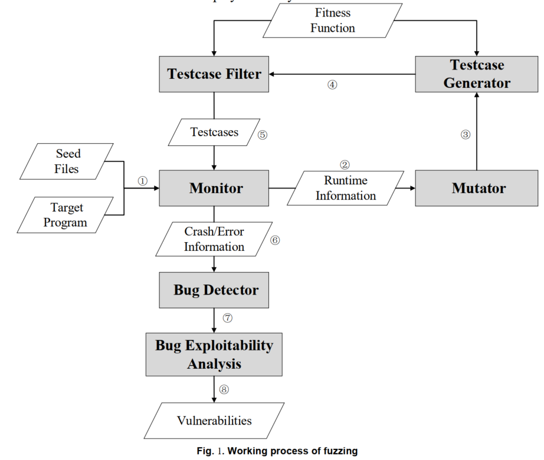
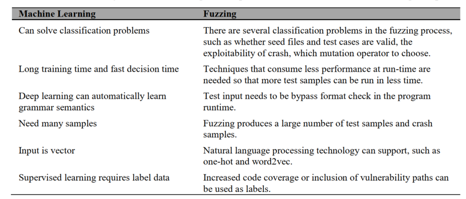
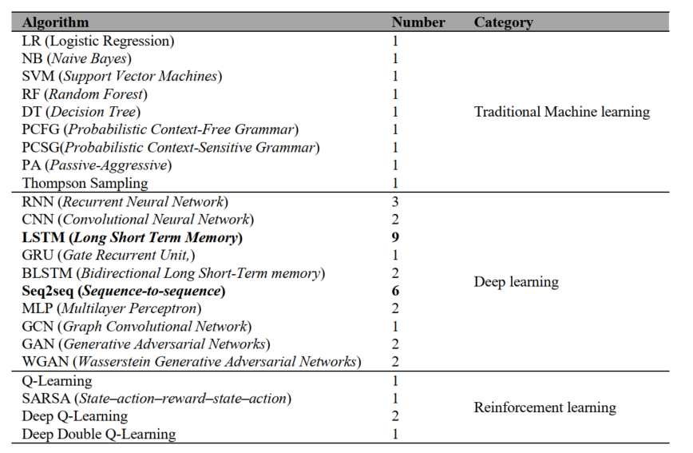
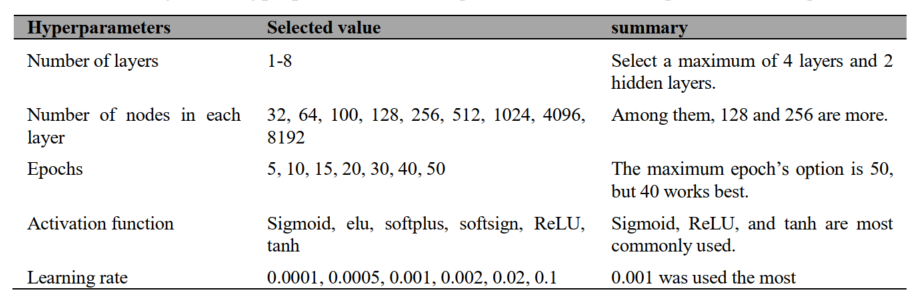
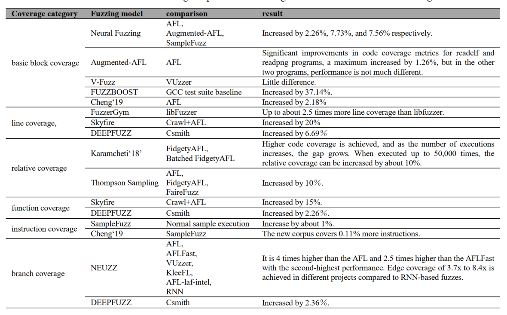
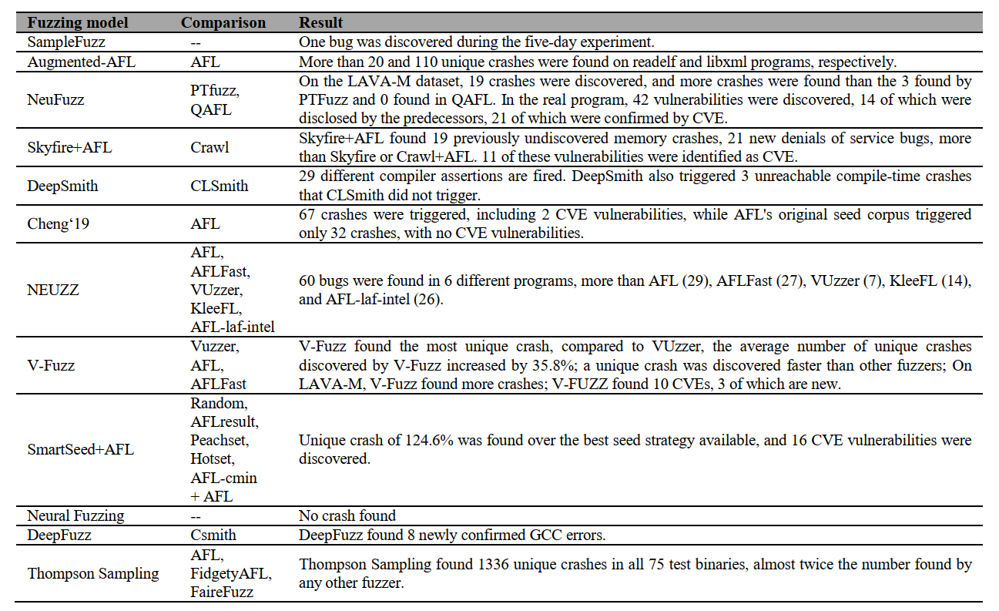
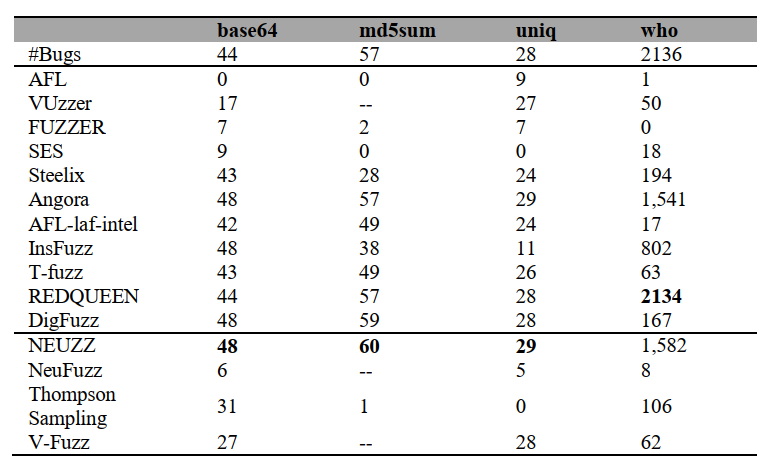
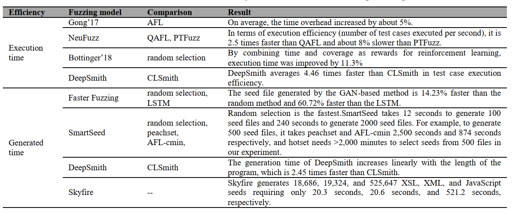

## 0x01 A systematic review of fuzzing based on machine learning techniques

[论文](./2020.05.06/paper.pdf)的一个大概翻译，主要讲的是ML在Fuzzing中的应用

传统的Fuzzing技术有：如何变异种子、如何增加覆盖率、如何有效的通过校验等问题，ML来拯救你。  
但ML也有问题，比如样本、漏洞特征等  

提出了九个问题！！！！！牛皮  
1. 为什么ML可以帮助Fuzzing  
2. Fuzzing的哪步可以用ML  
3. ML中的哪个算法用于Fuzzing  
4. 基于ML的Fuzzing，在数据预处理阶段用什么技术  
5. 测试与评估用什么数据集    
6. 评估结果选取什么标准  
7. ML模型中的hyperparameters如何被设定  
8. ML模型表现如何  
9. 基于ML的Fuzzing效果如何  

#### 1. 传统Fuzzing的不足

一般四个步骤：生成测试用例、运行程序、运行状态监测、分析crash  

生成测试用例：基于变异、基于生成

种子变异\  
        | -> 测试用例生成->测试用例筛选  
  生成  /  

运行时：插桩(Luk etal. 2005)、污点分析(Drewry and Ormandy 2007)  

之前的三个问题——如何变异种子、如何增加覆盖率、如何有效的通过校验——有很多方法来解决，如：  
- 静态分析：但没有运行时的上下文信息，高误报  
- 动态分析：
    1. 动态符号执行：路径爆炸、环境交互、内存建模、并行计算   
    2. 动态污点分析(Drewry and Ormandy 2007; Haller etal. 2013; Neugschwandtner et al. 2015)：under-tainting and over-tainting，是不是应该叫做过污染和欠污染  

#### 2. ML

- 机器学习：监督、半监督、无监督  
- 深度学习：表征学习
- 强化学习：自己做决策   

回答第一个问题  

Rajpal et al. 2017; Cheng et al. 2019; Wang et al. 2019

#### 3. 可以用，但是怎么用  

调研了29篇文章，测试用例生成11篇，变异方式选择有6篇，种子生成有5篇  

1. 种子生成

Skyfire (Wang et al. 2017)：使用PCFG(概率上下文敏感语法，包含语义规则和语法特征)来自动提取语义信息，生成种子  
Fast fuzzing (Nichols et al. 2017)：使用GAN，对抗训练生成增加运行路径的种子文件  
SmartSeed (Lv et al. 2018)：使用WGAN与MLP，将输入文件转换为统一的二进制矩阵，学习触发唯一crash或者唯一路径的特征  
Cheng et al. 2019：使用RNN与s2s找PDF与程序路径的关系，来生成覆盖新路径的种子  
NeuFuzz (Wang et al. 2019)：使用LSTM学习样本中已知的漏洞程序和隐藏的漏洞模式，发现可能包含漏洞的执行路径。优先执行能够覆盖包含漏洞路径的种子文件，并根据预测结果为这些种子文件分配更多的变异能量  

2. 测试用例生成  

Samplefuzz(Godefroid，2017)：使用基于神经网络的统计学习技术，从样本输入中自动生成输入语法。基于s2s递归神经网络的自动PDF对象学习生成模型  
Fan and Chang 2017：使用s2s对专有网络协议自动生成黑盒测试用例  
GANFuzz(Hu，2018)：使用GAN学习协议语法  
DeepSmith(Cummins，2018)：将程序的生成作为一个语言建模问题。使用LSTM学习编程语言的语法、语义以及常规结构和模式  
Sablotny，2018：使用堆栈式RNN模型，生成HTML标签和新的测试用例  
IUST DeepFuzz(Nasrabadi，2018)：使用基于深度递归神经网络（RNN）的神经语言模型（NLM）学习复杂输入文件的结构。IUST DeepFuzz首先删除了输入文件中的非文本部分，并将其替换为token。训练结束后，该token被替换为被删除部分的变体，以生成新的测试案例  
NEUZZ(She et al. 2019)：使用一种梯度引导的搜索策略，通过计算并使用平滑逼近梯度（即NN模型）来识别目标突变位置，可以最大限度地提高目标程序中检测到的错误数量  
Paduraru and Melemciuc 2018：根据文件格式对语料库进行聚类  使用s2s学习每个聚类的生成模型  
Li 2019b：使用WGAN生成工业控制协议的测试数据  
DeepFuzz(Liu，2019b)：使用s2s从GCC测试集中学习C语法，根据学习到的语法不断生成语法正确的C程序。然后，采用插入、替换、删除等策略生成测试用例  
V-Fuzz(Li等人2019a)：构建了一个图嵌入网络来训练漏洞预测模型。根据训练好的模型，生成倾向于到达潜在漏洞区域的用例。并提取出漏洞函数和安全函数的属性控制流程图，在函数层面上进行学习。。。。*emmmm什么意思*     

感觉没有提到我想要的论文，也少了很多。。。  

3. 测试用例筛选  

并不是所有牛奶都叫特仑苏  

Gong et al. (Gong et al. 2017)：可以预测种子是否改变程序的状态  
Augmented-AFL (Rajpal et al. 2017)：预测代码覆盖率。预测完整的输入文件的热图，对应于每个文件的位置发生突变的概率，从而产生新的代码覆盖率。然后用覆盖率图来确定突变位置的优先级。。。。*看不懂*。。。。  
Siddharth (Karamcheti et al. 2018b)：将程序输入映射到执行轨迹，并对执行轨迹分布的熵进行排序，不确定性越高，就越有可能出现一个新的代码路径，所以选择熵最大（最不确定）的输入来执行下一个输入。。。。*真牛皮，不懂*    

4. 选择变异算子  

Becker et al. (Becker et al. 2010)：FSM分解协议，得到三个不同的消息类型，使用基于三个不同回报函数的RL，来选择最好的策略  
LEFT (Fang and Yan 2018)：目标为Android手机中的LTE，三种策略，emulation-instrumented black-box fuzzing, threat-model-aware fuzzing, and RL-guided fuzzing    
Böttinger et al. 2018：RL，最大限度地提高代码覆盖率和更少的处理时间    
FuzzerGym (Drozd and Wagner 2018)：使用RL选择好的突变算子  
Karamcheti et al. 2018a：基于Robbers的Thompson Sampling优化方法，在Fuzzing中可以自适应地调整突变算子的分布。通过学习每个突变算子对代码覆盖率的影响，确定应该选择哪个突变算子*真牛皮，不懂*    
FUZZBOOST (Liu et al. 2019)：Q-learning覆盖率  

5. Fitness分析  

常见的fitness：代码覆盖率、潜在漏洞位置  

Sun et al. 2018：基于遗传编程的fitness，不同于基于代码覆盖率的方法。它将Markov-chain和PCFG模型相结合，从正常语料库中学习共性，并通过测量用例与共性用例的偏差来计算用例的不共性。偏差较大的用例可能更容易引发解释器的错误。这个偏差被用来计算基于GP的语言模糊化脚本的适配度 *我觉得这个不错Improving Fitness Function for Language Fuzzing with PCFG Model*      

6. 可利用分析

ExploitMeter (Yan et al. 2017)：贝叶斯  
Exniffer (Tripathi et al. 2018): SVM  
Zhan et al. (Zhang and Thing 2019): n-gram  

#### 4. ML分析  

1. 算法  

判断哪种算法对Fuzzing有效是一个很难的问题 *所以就用ML去选择ML算法吧*  

机器学习的算法很少被用到，可能和特征提取有关  
深度学习中，LSTM和s2s被用到很多次，GCN在Semi-supervised classification with graph convolutional networks  
RL在不同的环境中选择不同的操作，因此主要在选择变异算子中使用，RL也有缺点，such as long training time, weak convergence, and
local optimization, which leads to its less used in the fuzzing test (Mnih et al. 2013).  

2. 数据预处理

三类：程序分析、NLP、其他  
程序分析：栈、寄存器、指令、CFG、AST等  
NLP：n-gram、word2vec、热力图等  
其他：各种奇怪的方法。Gong et al. 2017：the binary sequence of testcase is
represented by 32-bits, fuzzing technique is represented by 4-bit, mutation bits is represented by 10-bit, and the
mutation value is represented by 32-bits, whether the new test case is represented by 1-bit. Finally, each piece of data
can be combined into a 79-bit binary sequence, with the first 78-bit as input and the last 1-bit as a label.*可以可以，绝了*    

3. 数据集  

爬虫、已经Fuzzing生成的、自建的、公开的(Github 2017、NIST 2006、GCC 2019、CGC 2016、LAVA、VDiscovery)    

4. 评估维度   

模型的表现与检测漏洞的能力  
模型的表现：召回率、误报、漏报、准确、精确等  
检测漏洞的能力：覆盖率、唯一路径、唯一crash、用例合理率、性能  

5. 超参数设定  

深度学习算法中的超参数选择主要是为了完成比较，主要包括层数、各层节点数、轮数、激活函数、学习率等   
当每层节点数较多时，也会出现过拟合现象。之前的场景中，最大层数为4，节点数分别为128和256  
随着epochs的增加，神经网络的权重更新迭代次数也会增加，损失函数曲线会从初始的欠拟合状态路过最优拟合状态，进入过拟合状态。通常情况下，选择的最大的次数为50次，但40次就能达到最佳   
激活函数的选择，可以提高神经网络的模型表达能力，解决了线性模型无法解决的问题。但不同的激活函数的优缺点是不同的，如sigmoid输入范围在[0，1]之间，但存在着"sigmoid saturate and kill gradients"而不是 "zero-centered"的问题（LeCun等，2012）。Tanh(Fan 2000)解决了非"zero-centered "的sigmoid输出，但仍存在其他问题。在fuzzing中，Sigmoid、ReLU和Tanh是最常用的激活函数*不懂*  
学习率控制着模型的学习进度，也影响着模型向局部最小值收敛的速度。学习率越高容易导致损失值的爆炸和冲击，而学习率越低则会导致模型的过拟合和收敛速度越慢。选择学习率的值有很多，0.001被广泛使用  

#### 5. 古今对比  

1. 覆盖率

但覆盖率并不是唯一的标准，比如有的Fuzzer专门去逼近可能有漏洞的区域  

2. 唯一路径

Augmented-AFL在readpdf和readelf中比AFL快两倍，但是在mupdf和libxml中没有什么提升  
SmartSeed好厉害  

3. 唯一crash

SmartSeed好厉害、Thompson Sampling好厉害  

但是

除了neuzz，机器学习的Fuzzer根本没什么用嘛。论文中有一句开脱    
> Due to the different goals, fewer the machine learning-based fuzzing tools can test the LAVA-M dataset

4. 用例合理率

ML生成的用例有很高的合理性  
但是，一般不合理的用例才会导致问题。。。。   
所以，还是要平衡啊  

5. 性能  

整体来说还是很不错的  

#### 6. 智者意见  

数据集：咩有统一的benchmark  
特征：使用NLP中高级的技术来提取有用的信息，如代码属性、语义语法特征  
算法：学习更精妙更适合的神经网络模型是很有必要的  

#### 7. Ref是个宝  

Abu-Nimeh S, Nappa D, Wang X, Nair S. A comparison of machine learning techniques for phishing detection. In: Proceedings of the anti-phishing working groups 2nd annual eCrime researchers summit; 2007. p. 60–9.  
Aschermann C, Schumilo S, Blazytko T, Gawlik R, Holz T. REDQUEEN: Fuzzing with Input-to-State Correspondence. In: NDSS; 2019.  
Avgerinos T, Cha SK, Rebert A, Schwartz EJ, Woo M, Brumley D. AEG: Automatic exploit generation. Commun ACM. 2014 Feb 1; 57(2). p.74–84.  
Avgerinos T, Rebert A, Cha SK, Brumley D. Enhancing symbolic execution with veritesting. Commun ACM. 2016 May 23; 59(6). p. 93–100.  
Bastani O, Sharma R, Aiken A, Liang P. Synthesizing program input grammars. ACM SIGPLAN Not. 2017 Jun 14; 52(6):95–110.  
Becker S, Abdelnur H, State R, Engel T. An Autonomic Testing Framework for IPv6 Configuration Protocols. In: IFIP International Conference on Autonomous Infrastructure, Management and Security. Springer, Berlin, Heidelberg, 2010. p. 65-76.  
Böttinger K, Godefroid P, Singh R. Deep reinforcement fuzzing. In: 2018 IEEE Security and Privacy Workshops (SPW). IEEE, 2018. p.116-122.  
Bucur S, Ureche V, Zamfir C, Candea G. Parallel symbolic execution for automated real-world software testing. In: Proceedings of the sixth conference on Computer systems. ACM, 2011. p. 183-98.18  
Cadar C, Dunbar D, Engler DR. KLEE: Unassisted and Automatic Generation of High-Coverage Tests for Complex Systems Programs. In: Proc 8th USENIX Conf Oper Syst Des Implement. 2008; 8. p. 209–24.  
Cadar C, Twohey P, Ganesh V, Engler D. EXE: A system for automatically generating inputs of death using symbolic execution. In: Proceedings of the ACM Conference on Computer and Communications Security. 2006.  
Cha SK, Avgerinos T, Rebert A, Brumley D. Unleashing Mayhem on Binary Code. In: 2012 IEEE Symposium on Security and Privacy. IEEE;2012. p. 380–94.  
Chen P, Chen H. Angora: Efficient Fuzzing by Principled Search. In: 2018 IEEE Symposium on Security and Privacy (SP). IEEE; 2018. p.711–25.  
Chen Y, Groce A, Zhang C, Wong W-K, Fern X, Eide E, et al. Taming compiler fuzzers. In: ACM SIGPLAN Not. 2013 Jun 23; 48(6).p.197-208.  
Cheng L, Zhang Y, Zhang Y, Wu C, Li Z, Fu Y, et al. Optimizing seed inputs in fuzzing with machine learning. In: Proceedings of the 41st International Conference on Software Engineering: Companion Proceedings. IEEE Press, 2019. p. 244-5.  
Chernis B, Verma R. Machine Learning Methods for Software Vulnerability Detection. In: Proceedings of the Fourth ACM International Workshop on Security and Privacy Analytics ACM. 2018. p. 31–9.  
Chipounov V, Kuznetsov V, Candea G. S2E: A platform for in-vivo multi-path analysis of software systems. In: ACM SIGARCH Computer Architecture News. 2011. p. 265–78.  
Collobert R, Weston J. A unified architecture for natural language processing: Deep neural networks with multitask learning. In: Proceedings of the 25th international conference on Machine learning. ACM, 2008. p. 160-7.  
Cummins C, Petoumenos P, Murray A, Leather H. Compiler fuzzing through deep learning. In: Proceedings of the 27th ACM SIGSOFT International Symposium on Software Testing and Analysis. ACM, 2018: 95-105.  
Damashek M. Gauging Similarity with n-Grams: Language-Independent Categorization of Text. In: Science (80- ). 1995 Feb 10;267(5199):843–8.  
Debar H, Becker M, Siboni D. A neural network component for an intrusion detection system. In: Proceedings 1992 IEEE Computer Society Symposium on Research in Security and Privacy. 1992. p. 240–50.  
Deng L, Yu D, others. Deep learning: methods and applications. Found Trends®in Signal Process. 2014; 7(3--4). p. 197–387.  
Dolan-Gavitt B, Hulin P, Kirda E, Leek T, Mambretti A, Robertson W, et al. Lava: Large-scale automated vulnerability addition. In: 2016 IEEE Symposium on Security and Privacy (SP). 2016. p. 110–21.  
Drewry W, Ormandy T. Flayer: exposing application internals. 2007;  
Drozd W, Wagner MD. FuzzerGym: A Competitive Framework for Fuzzing and Learning. arXiv preprint arXiv:1807.07490, 2018.  
Ernst MD. Static and dynamic analysis: Synergy and duality. In: WODA 2003: ICSE Workshop on Dynamic Analysis. 2003. p. 24–7.  
Fan E. Extended tanh-function method and its applications to nonlinear equations. Phys Lett A. 2000 Dec; 277(4–5). p. 212–8.  
Fan R, Chang Y. Machine Learning for Black-Box Fuzzing of Network Protocols. In: International Conference on Information and Communications Security. 2017. p. 621–32.  
Fan R, Chang Y. Machine learning for black-box fuzzing of network protocols. In: International Conference on Information and Communications Security. Springer, Cham, 2017.p. 621-32.  
Fang K, Yan G. Emulation-Instrumented Fuzz Testing of 4G/LTE Android Mobile Devices Guided by Reinforcement Learning. In: European Symposium on Research in Computer Security. 2018. p. 20–40.  
Fette I, Sadeh N, Tomasic A. Learning to detect phishing emails. In: Proceedings of the 16th international conference on World Wide Web. 2007.p. 649–56.  
Github. Learning from “Big Code” [Internet]. 2017 [cited 2019 Jul 17]. Available from: http://learnbigcode.github.io/datasets/  
Godefroid P, Kiezun A, Levin MY. Grammar-based whitebox fuzzing. ACM SIGPLAN Not; 2008 May 30; 43(6). p. 206–15.  
Godefroid P, Peleg H, Singh R. Learn&Fuzz: Machine learning for input fuzzing. In: 2017 32nd IEEE/ACM International Conference on  
Automated Software Engineering (ASE). IEEE; 2017. p. 50–9.
Goldberg Y, Levy O. word2vec Explained: deriving Mikolov et al.’s negative-sampling word-embedding method. arXiv preprint arXiv:1402.3722, 2014.  
Gong W, Zhang G, Zhou X. Learn to Accelerate Identifying New Test Cases in Fuzzing. In: /International Conference on Security, Privacy and Anonymity in Computation, Communication and Storage. Springer, Cham; 2017. p. 298–307.    
Goodfellow I, Pouget-Abadie J, Mirza M, Xu B, Warde-Farley D, Ozair S, et al. Generative adversarial nets. In: Advances in neural information processing systems; 2014. p. 2672–80.  
Grieco G, Grinblat GL, Uzal L, Rawat S, Feist J, Mounier L. Toward Large-Scale Vulnerability Discovery using Machine Learning. In:Proceedings of the Sixth ACM Conference on Data and Application Security and Privacy. ACM; 2016. p. 85–96.19  
Haller I, Slowinska A, Bos H, Neugschwandtner MM. Dowsing for Overflows: A Guided Fuzzer to Find Buffer Boundary Violation. SEC ’13 Proc 22nd USENIX Conf Secur; 2013; 49–64.  
Höschele M, Zeller A. Mining input grammars from dynamic taints. In: Proceedings of the 31st IEEE/ACM International Conference on Automated Software Engineering. ACM: 2016. p. 720–5.  
Hu Z, Shi J, Huang Y, Xiong J, Bu X. Ganfuzz: A Gan-based industrial network protocol fuzzing framework. In: /Proceedings of the 15th ACM International Conference on Computing Frontiers. ACM; 2018. p. 138–45.  
Huang W, Stokes JW. MtNet: A Multi-Task Neural Network for Dynamic Malware Classification. In: International Conference on Detection of Intrusions and Malware, and Vulnerability Assessment. Springer, Cham; 2016. p. 399–418.  
Javaid A, Niyaz Q, Sun W, Alam M. A deep learning approach for network intrusion detection system. In: Proceedings of the 9th EAI International Conference on Bio-inspired Information and Communications Technologies (formerly BIONETICS); 2016. p. 21–6.  
Kang MG, McCamant S, Poosankam P, Song D. Dta++: dynamic taint analysis with targeted control-flow propagation. In: NDSS. 2011.  
Karamcheti S, Mann G, Rosenberg D. Adaptive Grey-Box Fuzz-Testing with Thompson Sampling. In: Proceedings of the 11th ACM Workshop on Artificial Intelligence and Security. ACM; 2018a. p. 37–47.  
Karamcheti S, Mann G, Rosenberg D. Improving Grey-Box Fuzzing by Modeling Program Behavior. arXiv Prepr arXiv181108973. 2018b.  
Kifetew FM, Tiella R, Tonella P. Generating valid grammar-based test inputs by means of genetic programming and annotated grammars. EmpirSoftw Eng; 2017 Apr 14; 22(2). p. 928–61.  
Kinder J, Zuleger F, Veith H. An Abstract Interpretation-Based Framework for Control Flow Reconstruction from Binaries. In: International Workshop on Verification, Model Checking, and Abstract Interpretation. Springer, Berlin, Heidelberg; 2009. p. 214–28.  
King JC. Symbolic execution and program testing. Commun ACM; 1976 Jul 1; 19(7). p. 385–94.  
Kipf TN, Welling M. Semi-supervised classification with graph convolutional networks. arXiv Prepr arXiv160902907. 2016;  
Krizhevsky A, Sutskever I, Hinton GE. Imagenet classification with deep convolutional neural networks. In: Advances in neural information processing systems; 2012. p. 1097–105.  
Lane T, Brodley CE. An application of machine learning to anomaly detection. In: Proceedings of the 20th National Information Systems Security Conference; 1997. p. 366–80.  
Lcamtuf. AFL fuzzing strategies; 2014. [cited 2019 Jul 18]. Available from:
https://lcamtuf.blogspot.com/2014/08/binary-fuzzing-strategies-whatworks.html  
LeCun Y, Bengio Y, Hinton G. Deep learning. Nature; 2015; 521 (7553). p. 436.  
LeCun YA, Bottou L, Orr GB, Müller KR. Efficient backprop. Lect Notes Comput Sci (including Subser Lect Notes Artif Intell Lect Notes
Bioinformatics). 2012; 9–48.  
Li J, Zhao B, Zhang C. Fuzzing: a survey. Cybersecurity; 2018 Dec 5; 1(1) .p. 6.  
Li Y, Ji S, Lv C, Chen Y, Chen J, Gu Q, et al. V-Fuzz: Vulnerability-Oriented Evolutionary Fuzzing. arXiv preprint arXiv:1901.01142. 2019a.  
Li Z, Zhao H, Shi J, Huang Y, Xiong J. An Intelligent Fuzzing Data Generation Method Based on Deep Adversarial Learning. IEEE Access. 2019b; 7. p. 49327–40.  
Liu L, He X, Liu L, Qing L, Fang Y, Liu J. Capturing the symptoms of malicious code in electronic documents by file’s entropy signal combined with machine learning. Appl Soft Comput; 2019a Sep; 82. p. 105598.  
Liu X, Li X, Prajapati R, Wu D. DeepFuzz: Automatic Generation of Syntax Valid C Programs for Fuzz Testing. In: Proceedings of the... AAAI Conference on Artificial Intelligence; 2019b;  
Liu Xiao, Prajapati, Rupesh, Li Xiaoting WD. Reinforcement Compiler Fuzzing; 2019.  
Luk C, Cohn R, Muth R, Patil H, Klauser A, Lowney G, et al. Pin: building customized program analysis tools with dynamic instrumentation. ACM SIGPLAN Not; 2005 Jun 12; 40(6). p. 190.  
Lv C, Ji S, Li Y, Zhou J, Chen J, Chen J. SmartSeed: Smart Seed Generation for Efficient Fuzzing; arXiv preprint arXiv:1807.02606; 2018.  
Menczer F, Pant G, Srinivasan P, Ruiz ME. Evaluating topic-driven web crawlers. In: Proceedings of the 24th annual international ACM SIGIR conference on Research and development in information retrieval; 2001. p. 241–9.  
Miller BP, Fredriksen L, So B. An empirical study of the reliability of UNIX utilities. Commun ACM. 1990 Dec 1; 33 (12). p. 32–44.  
Mitchell TM. Machine learning and data mining. Commun ACM. 1999; 42(11).  
Mnih V, Kavukcuoglu K, Silver D, Graves A, Antonoglou I, Wierstra D, et al. Playing Atari with Deep Reinforcement Learning. arXiv Prepr arXiv13125602; 2013 Dec 19;  
Nasrabadi MZ, Parsa S, Kalaee A. Format-aware Learn&Fuzz: Deep Test Data Generation for Efficient Fuzzing. arXiv Prepr arXiv181209961; 2018 Dec 24;  
Neal RM. Pattern Recognition and Machine Learning. Technometrics; 2007 Aug; 49(3). p. 366–366.  
Neugschwandtner M, Milani Comparetti P, Haller I, Bos H. The BORG. In: Proceedings of the 5th ACM Conference on Data and Application Security and Privacy - CODASPY ’15. New York, New York, USA: ACM Press; 2015. p. 87–97.     
Nichols N, Raugas M, Jasper R, Hilliard N. Faster Fuzzing: Reinitialization with Deep Neural Models. arXiv preprint arXiv:1711.02807; 2017.      
NIST. The NIST SARD project [Internet]. 2006 [cited 2019 Jul 17]. Available from: https://samate.nist.gov/SRD/testsuite.php20     
Oehlert P. Violating Assumptions with Fuzzing. IEEE Secur Priv Mag; 2005 Mar; 3(2). p. 58–62.      
Paduraru C, Melemciuc M-C. An Automatic Test Data Generation Tool using Machine Learning. In: Proceedings of the 13th International  
Conference on Software Technologies. SCITEPRESS - Science and Technology Publications; 2018. p. 506–15.  
Peng H, Shoshitaishvili Y, Payer M. T-Fuzz: Fuzzing by Program Transformation. In: 2018 IEEE Symposium on Security and Privacy (SP). IEEE; 2018. p. 697–710.  
Rajpal M, Blum W, Singh R. Not all bytes are equal: Neural byte sieve for fuzzing; 2017 Nov 9; 1–10.  
Rebert A, Cha SK, Avgerinos T, Foote J, Warren D, Grieco G, et al. Optimizing seed selection for fuzzing. In: 23rd {USENIX} Security Symposium ({USENIX} Security 14); 2014. p. 861–75.  
Sablotny M, Jensen BS, Johnson CW. Recurrent Neural Networks for Fuzz Testing Web Browsers. In: International Conference on Information Security and Cryptology; 2018. p. 354–70.  
Serebryany K, Bruening D. AddressSanitizer: a fast address sanity checker. In: Presented as part of the 2012 {USENIX} Annual Technical Conference ({USENIX} {ATC} 12); 2012. p. 309–18.  
She D, Pei K, Epstein D, Yang J, Ray B, Jana S. NEUZZ: Efficient Fuzzing with Neural Program Smoothing; IEEE Symposium on Security & Privacy; 2019, 89(46). p. 38.  
Shoshitaishvili Y, Wang R, Hauser C, Kruegel C, Vigna G. Firmalice - Automatic Detection of Authentication Bypass Vulnerabilities in Binary Firmware. In: Proceedings 2015 Network and Distributed System Security Symposium. Reston, VA: Internet Society; 2015.  
Slowinska A, Stancescu T, Bos H. Body armor for binaries: preventing buffer overflows without recompilation. ATC’12 Proc 2012 USENIX Conf Annu Tech; 2012 .p. 125–37.  
Sparks S, Embleton S, Cunningham R, Zou C. Automated Vulnerability Analysis: Leveraging Control Flow for Evolutionary Input Crafting. In:Twenty-Third Annual Computer Security Applications Conference (ACSAC 2007). IEEE; 2007 .p. 477–86.  
Sun X, Fu Y, Dong Y, Liu Z, Zhang Y. Improving Fitness Function for Language Fuzzing with PCFG Model. In: 2018 IEEE 42nd Annual Computer Software and Applications Conference (COMPSAC). IEEE; 2018. p. 655–60.  
Sutton RS, Barto AG. Reinforcement learning: An introduction. MIT press; 2018.  
Sutton RS, Barto AG, others. Introduction to reinforcement learning. Vol. 2. MIT press Cambridge; 1998.  
Titonis TH, Manohar-Alers NR, Wysopal CJ. Automated behavioral and static analysis using an instrumented sandbox and machine learning classification for mobile security. Google Patents; 2017.  
Tripathi S, Grieco G, Rawat S. Exniffer: Learning to Prioritize Crashes by Assessing the Exploitability from Memory Dump. In: 2017 24th Asia-Pacific Software Engineering Conference (APSEC). IEEE; 2017 .p. 239-48.  
Wang J, Chen B, Wei L, Liu Y. Skyfire: Data-Driven Seed Generation for Fuzzing. In: 2017 IEEE Symposium on Security and Privacy (SP). IEEE; 2017. p. 579–94.  
Wang Y, Wu Z, Wei Q, Wang Q. NeuFuzz: Efficient Fuzzing With Deep Neural Network. IEEE Access; 2019, 7 .p. 36340–52.  
Wichmann BA, Canning AA, Marsh DWR, Clutterbuck DL, Winsborrow LA, Ward NJ. Industrial perspective on static analysis. Softw Eng J; 1995, 10(2) .p. 69.  
Wu F, Wang J, Liu J, Wang W. Vulnerability detection with deep learning. In: 2017 3rd IEEE International Conference on Computer and Communications (ICCC); 2017. p. 1298–302.  
Xie T, Tillmann N, de Halleux J, Schulte W. Fitness-guided path exploration in dynamic symbolic execution. In: 2009 IEEE/IFIP International Conference on Dependable Systems & Networks. IEEE; 2009. p. 359–68.  
Yan G, Lu J, Shu Z, Kucuk Y. ExploitMeter: Combining Fuzzing with Machine Learning for Automated Evaluation of Software Exploitability. In: 2017 IEEE Symposium on Privacy-Aware Computing (PAC). IEEE; 2017 .p. 164-75.   
Zhang G, Zhou X, Luo Y, Wu X, Min E. PTfuzz: Guided Fuzzing With Processor Trace Feedback. IEEE Access; 2018, 6 .p. 37302–13.  
Zhang H, Zhou A, Jia P, Liu L, Ma J, Liu L. InsFuzz: Fuzzing Binaries with Location Sensitivity. IEEE Access; 2019, 7 .p. 22434-44.  
Zhang L, Thing VLL. Assisting Vulnerability Detection by Prioritizing Crashes with Incremental Learning. In: TENCON 2018-2018 IEEE Region 10 Conference. IEEE; 2018 .p. 2080-5.  
Zhao L, Duan Y, Yin H, Xuan J. Send Hardest Problems My Way: Probabilistic Path Prioritization for Hybrid Fuzzing. In: Proceedings 2019 Network and Distributed System Security Symposium. Reston, VA: Internet Society; 2019.  
Zou Q, Zhang T, Wu R, Ma J, Li M, Chen C, et al. From automation to intelligence: Survey of research on vulnerability discovery techniques.Qinghua Daxue Xuebao/Journal Tsinghua Univ; 2018, 58(12) .p. 1079–94.  