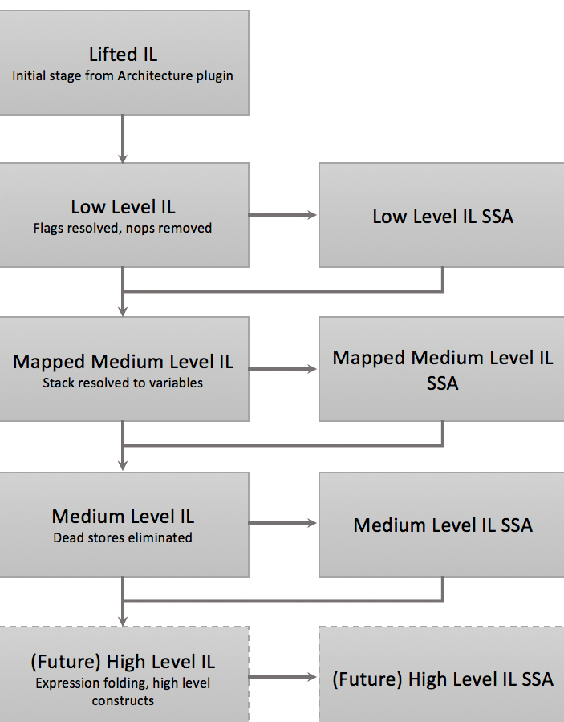

## 0x01 BN的LLIL

官方对[LLIL](https://docs.binary.ninja/dev/bnil-llil.html)的介绍  
使用官方提供的[测试程序](./2020.05.15/chal1)  

```python
for func in bv.functions:
    if func.name == "main":
        for block in func.low_level_il:
            #current_function.low_level_il:
            for instr in block:
                print(instr.address, instr.instr_index, instr)
```

使用low_level_il获取的按理来说就是一个函数   
```python
>>> current_function.low_level_il
<llil func: x86_64@0x4007c6>
>>> type(current_function.low_level_il)
<class 'binaryninja.lowlevelil.LowLevelILFunction'>
```
但是list之后就会得到函数的基本块   
```python
>>> list(current_function.low_level_il)
[<llil block: x86_64@0-54>, <llil block: x86_64@54-60>, <llil block: x86_64@60-62>, <llil block: x86_64@62-76>, <llil block: x86_64@76-80>, <llil block: x86_64@80-83>]
```
如果直接取的话，得到的是指令，其中的数字就是instr_index     
```python
>>> current_function.low_level_il[2]
<il: rsp = rsp - 0x100>
>>> type(current_function.low_level_il[2])
<class 'binaryninja.lowlevelil.LowLevelILInstruction'>
```

LLIL表示为expression trees  

```python
>>> dir(ins)
['ILOperations', '__class__', '__delattr__', '__dict__', '__dir__', '__doc__', '__eq__', '__format__', '__ge__', '__getattribute__', '__gt__', '__hash__', '__init__', '__init_subclass__', '__le__', '__lt__', '__module__', '__ne__', '__new__', '__reduce__', '__reduce_ex__', '__repr__', '__setattr__', '__sizeof__', '__str__', '__subclasshook__', '__weakref__', '_address', '_expr_index', '_flags', '_function', '_instr_index', '_operands', '_operation', '_size', '_source_operand', 'address', 'dest', 'expr_index', 'flags', 'function', 'get_flag_value', 'get_flag_value_after', 'get_possible_flag_values', 'get_possible_flag_values_after', 'get_possible_reg_values', 'get_possible_reg_values_after', 'get_possible_stack_contents', 'get_possible_stack_contents_after', 'get_possible_values', 'get_reg_value', 'get_reg_value_after', 'get_stack_contents', 'get_stack_contents_after', 'il_basic_block', 'instr_index', 'mapped_medium_level_il', 'medium_level_il', 'mlil', 'mmlil', 'non_ssa_form', 'operands', 'operation', 'possible_values', 'postfix_operands', 'prefix_operands', 'size', 'source_operand', 'src', 'ssa_form', 'tokens', 'value']
>>> ins
<il: [rbp - 0xc0 {var_c8}].q = rax>
>>> ins.operands
[<il: rbp - 0xc0>, <il: rax>]
>>> ins.operands[0].operands
[<il: rbp>, <il: -0xc0>]
>>> ins.operands[0].left
<il: rbp>
>>> ins.operands[0].right
<il: -0xc0>
>>> ins.operands[0].operation
<LowLevelILOperation.LLIL_ADD: 22>
```
看一下指令都有什么方法，于是可以实现：筛选往rdx中存数据的指令  
`instr.operation == LowLevelILOperation.LLIL_STORE and instr.src.__str__() == 'rdx'`

## 0x02 BN的MLIL  
[官方文档](https://docs.binary.ninja/dev/bnil-mlil.html)  

可以直接上LLIL上使用mlil方法得到中级表示  
```python
>>> ins
<il: [rbp - 0xc0 {var_c8}].q = rax>
>>> ins.mlil
<il: var_c8 = rax>
```
MLIL：
1. 寄存器被替换为变量，而且变量有类型    
2. 不在具体的表示栈  
3. 数据流！！！，提供了一些数据里API  
4. 死代码消除  

具体可以看main函数的LLIL->MLIL  

```asm
+----------------------------------------------+          +-----------------------------------------+
|  0 @ 004007c6  push(rbp)                     |          |                                         |
|  1 @ 004007c7  rbp = rsp {__saved_rbp}       |          |                                         |
|  2 @ 004007ca  rsp = rsp - 0x100             |          |   0 @ 004007d6  rax = time(0)           |
|  3 @ 004007d1  edi = 0                       |          |   1 @ 004007db  int64_t var_c8 = rax    |
|  4 @ 004007d6  call(time)                    +--------->+   2 @ 004007e9  int64_t* rdi = &var_c8  |
|  5 @ 004007db  [rbp - 0xc0 {var_c8}].q = rax |          |   3 @ 004007ec  rax_1 = localtime(rdi)  |
|  6 @ 004007e2  rax = rbp - 0xc0 {var_c8}     |          |   4 @ 004007f1  int64_t rdx = [rax_1].q |
|  7 @ 004007e9  rdi = rax {var_c8}            |          |                                         |
|  8 @ 004007ec  call(localtime)               |          |                                         |
+----------------------------------------------+          +-----------------------------------------+
```

选取MLIL中的004007db
```python
>>> ins.dest
<var int64_t var_c8>
>>> type(ins.dest)
<class 'binaryninja.function.Variable'>
```

感觉后边的内容没什么了。。。。   
