## 套娃

感觉[德罗斯特效应](https://zh.wikipedia.org/wiki/%E5%BE%B7%E7%BD%97%E6%96%AF%E7%89%B9%E6%95%88%E5%BA%94)似乎更精确一点


#### 0x01 droste.zip

一个神奇的[压缩包](https://issues.apache.org/jira/browse/TIKA-259)
解压之后，是一张图片还有[压缩包自己](./2020.05.04/droste.zip)

最开始是在一个CTF里遇到了这个压缩包，当时只记得有一张斯坦因之石的图片，然后各种搜索，是LCTF2016的Misc，继续找才找到。。。

#### 0x02 Fork 炸弹

```bash
:()   #定义函数，函数名为:，没有参数
{
:|: & #递归调用本函数，管道起新进程，并放后台
}
;
:    #调用:
```
Windows的WSL中跑了一下，蓝屏了？？？不应该啊

#### 0x03 网络回环

盗CCNA的一张图

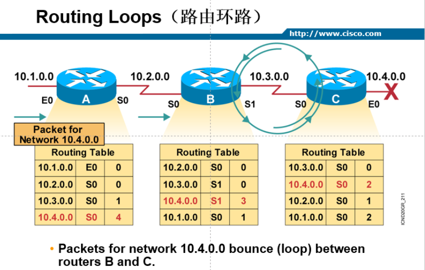

初始，B到10.4.0.0需要一跳，A到10.4.0.0需要两跳
此时10.4.0.0网段挂了，C收到B的广播，一看，B到10.4.0.0需要一跳，而自己现在到不了10.4.0.0，所以需要通过B到达10.4.0.0，因此更新自己为两跳。
B收到C的广播，在C的基础上+1。。。拍卖场
那么问题来了，明明我自身的跳数小，为什么还要在传来的基础上+1，忘了。。。

水平分割、毒性逆转，RIP的最大15跳


#### 0x04 Pysnnor

Python的一个调试工具
本来想要O一样的闭环，但是只能6了

#### 0x05 调试器

调试器调试自己

本来想x64自己调试自己的，但是它自己附加进程时应该是摘掉了自己
所以，两个x64，A附加B，运行，B返回来附加A
然后

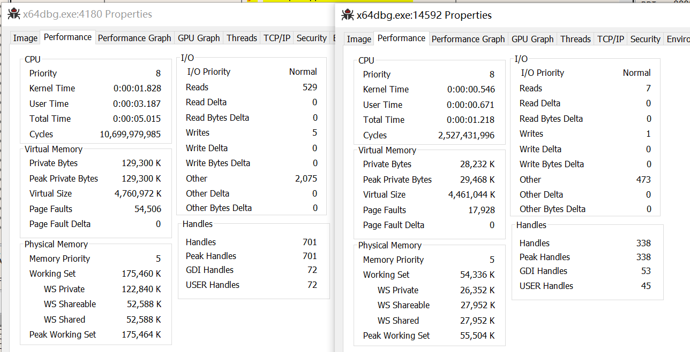

统统挂掉了，死锁？？？还是想找一个自己能够附加自己的。。。。（不想patch）

#### 0x06 Fuzzer

插曲：跑了一下，然后发现，箭头指的方向是什么？？？越界读？？？

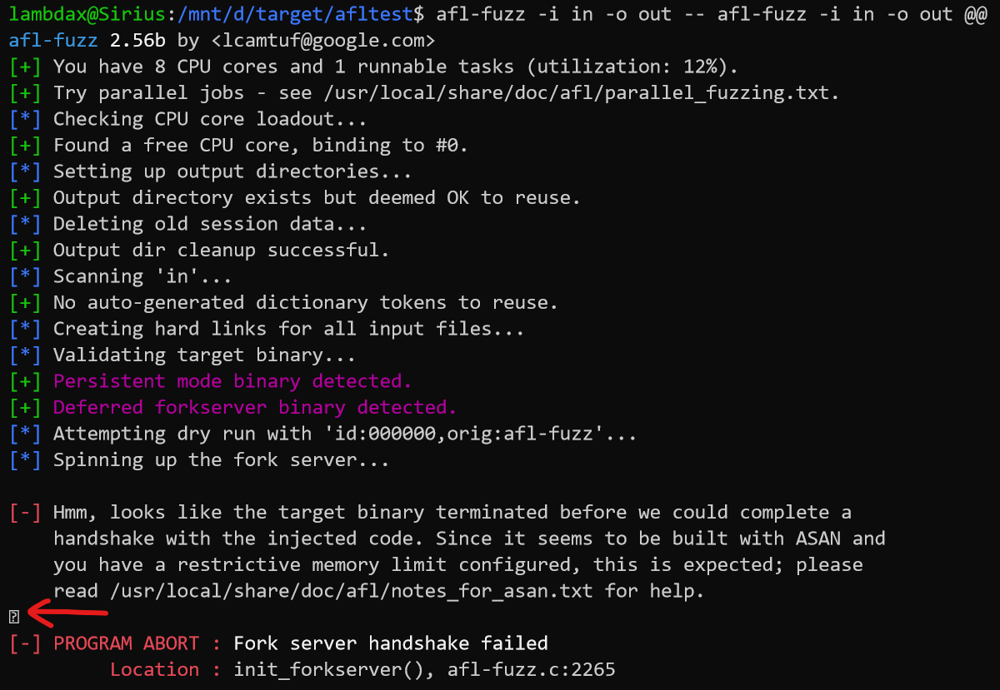

卧槽，我要留名史册了，开熏。。。用screen记录了一下log，但是发现52b版与56版泄露的都一样啊

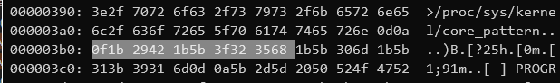

哈？？？那有个毛用。。。随便是一个正常的，还是有这个玩意，再一想，之前根本没有遇到过这情况啊？换mac的终端跑一下，消失了。。。。。哈？？？？
再仔细看一看“泄露"的数据，0x1b开头？emmmmm，这不就是ESC嘛，这不就是控制字符码，然后看了眼源码

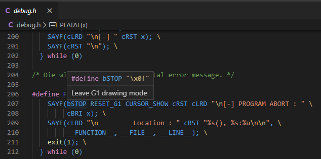

QNMLGB的，windows的terminal就是屎！！！！！！！！！害老子白激动了

算了，懒得折腾这个了，跑honggfuzz吧
`honggfuzz -f in_h/ -- /usr/local/bin/honggfuzz -f in_h/ -- ___FILE___`

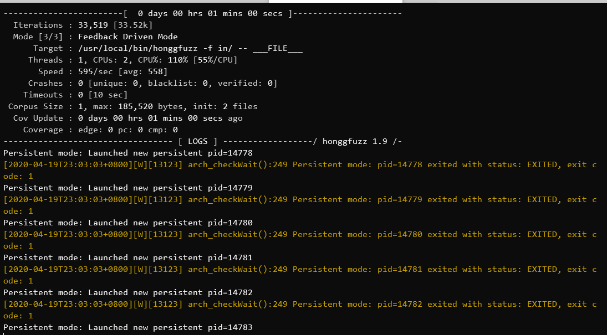

在怀疑有没有跑起来，覆盖率为0？？？

```python
import os
import sys

cmd = "./h -f i -- " +  "h -f i -- " * int(sys.argv[1])
cmd += "___FILE___"
os.system(cmd)
```

为什么命令这么精简呢，因为命令行长度有限制
getconf ARG_MAX => 209715
这个根本不准，换一个，得到131072

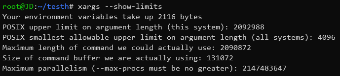

所以输入13104之后

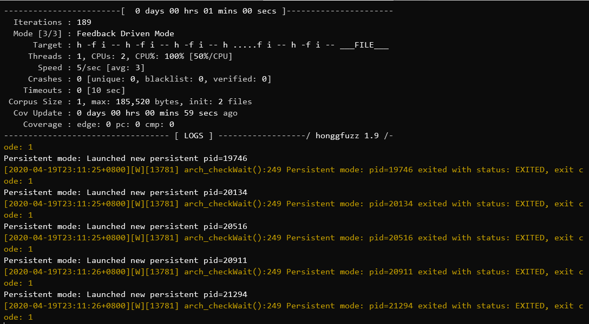

除了一趟变慢了，覆盖率还为0。。。。。

#### 0x07 Rust

```rust
fn call_self() {
    call_self();
}

fn main() {
    call_self();
}
```

Window的报错和Linux的竟然不一样，报错信息中的exit code竟然在cargo的源码中

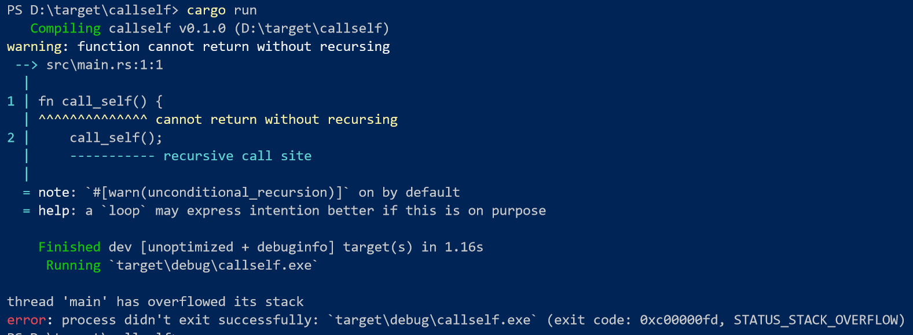

Linux中的debug版直接Abort，真不友好啊，不过这个在src/libstd/sys_common/util.rs，指的是单纯的打印报错信息

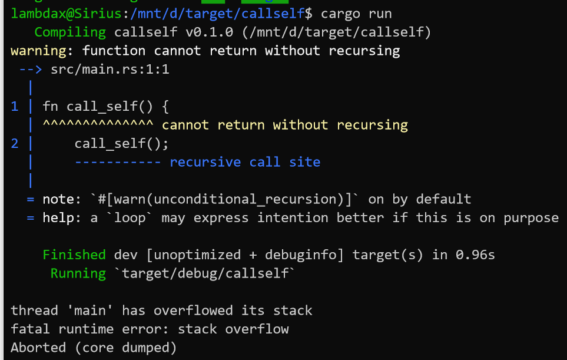

你看release版多么的悄无声息

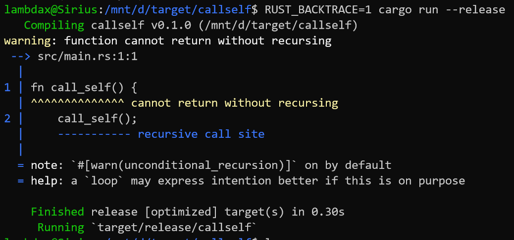

#### 0x07 C、Python

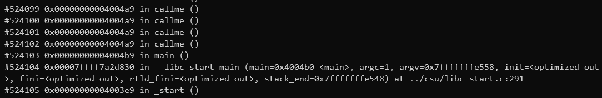

那么这个524103的深度怎么来的，每次调用自己一次，抬升0x10

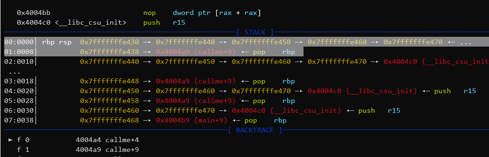

总共 8192 * 1024 / 0x10 = 524288

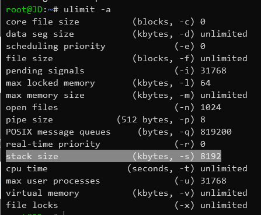

python默认一千次吧

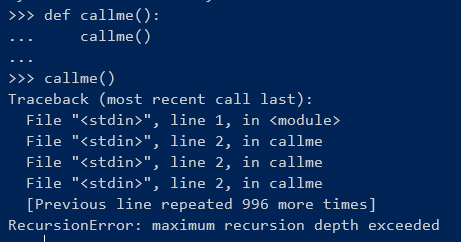

#### 0x08 grep/cat/ripgrep/bat

本想自己读入并匹配自己写到磁盘的文件，grep -rni "hello" . > localwrite.txt，但是，不给我这个机会啊。stat可以查看inode

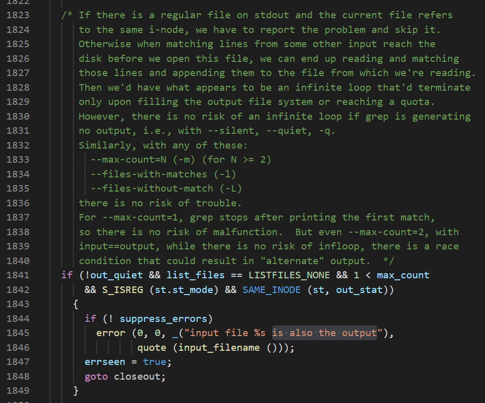

那我们 cat localfile.txt >> localfile.txt，结果
> cat: localfile.txt : input file is output file

cat不行那我们就用bat

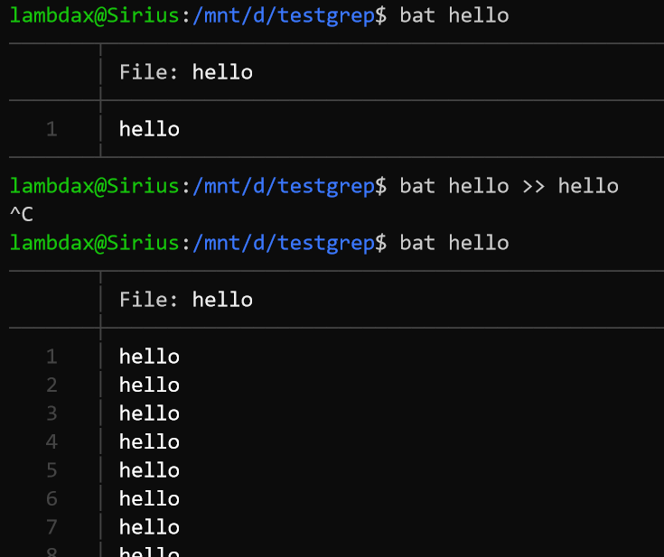

再试试rust写的ripgrep，rg默认就是递归文件夹的

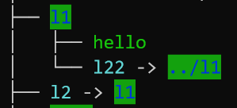

结果挺好

#### 0x09 其他

php:include
重定向

#### 0x0A 有毛用

有用吗？有用
有什么用？没啥用
就目前我所见到的小领域里，就出现了两三次而已，还都只是DoS
但是触发原因还很有小领域的特色，有特色当然就有意思
洞大洞小的有什么用
