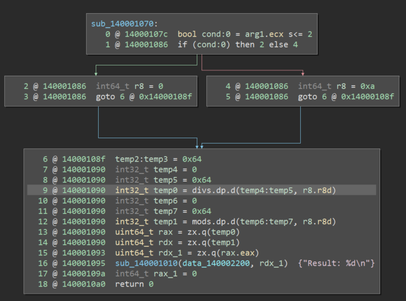

## 0x01 Binary Ninja的headless

买了个个人版。。。不知道为什么买  

关于不同IR类型，我觉的这篇[文章](https://bbs.pediy.com/thread-247121.htm)汇总的不错

Python代码只能在GUI中跑，没有headless的功能，高级版才有。。。  

BN启动时，Python在`_init_plugins`时，执行`core.BNInitCorePlugins()`，core其实就是binaryninjacore.dll  

在sub_1802F3550里有一段  
```
    if ( Size == 12 )
    {
        v85 = memcmp(v81, "Binary Ninja", Size);
        v86 = byte_1815D4019;
        if ( !v85 )
        v86 = 1;
        byte_1815D4019 = v86;
    }
    v87 = &v108;
    if ( v83 >= 0x10 )
        v87 = v82;
    if ( v84 != 21 || memcmp(v87, "Binary Ninja Personal", 0x15ui64) )
    if ( byte_1815D4019 )
        memset(v144, 0, 0x32E8ui64);
        if ( (unsigned int)sub_18045C9E0(v144) )
        else if ( (unsigned int)sub_18045CA00((char *)&v145, 24, v144) )
        else if ( (unsigned int)sub_18045CA60(v144) )
        else if ( (unsigned int)sub_18045CBF0((__int64)&word_181592000, 0x504u, v144) == 1284 )
            byte_1815D4018 = 1;
```

byte_1815D4018这个值在`core.BNIsLicenseValidated()`时检测

哎 哪有这闲工夫

反正目的就是，不想一点一点的在GUI的命令行输入代码，想在文本中写好，然后直接执行  
所以，首先在命令行中得到当前的目录位置  

```bash
>>> os.getcwd()
'C:\\Users\\XX\\AppData\\Local\\Vector35\\BinaryNinja'
```

然后在这个目录新建脚本文件mybn.py，写完自己的代码之后，直接回命令行import一下就好。。。。。  
但是，import一次之后，如果修改了脚本，此时再次import时不能重新执行的  
Python3的环境下，`del package`后再import也不行，Python2没有尝试  
所以需要reload(Python2)  
或者Python3的  
```python
import imp
imp.reload(package)
```

测试脚本  
```python
from binaryninja import *
target = "D:\\target\\callself\\target\\release\\callself"

print("Analyzing file: {}".format(target))
bv = BinaryViewType.get_view_of_file(target)
bv.add_analysis_option('linearsweep')

for func in bv.functions:
    print("Function: {}".format(func.name))
```

效果  

```
>>> import mybn
>>> import mybn
>>> del mybn
>>> imp.reload(mybn)
Traceback (most recent call last):
  File "<console>", line 1, in <module>
NameError: name 'mybn' is not defined
>>> import mybn
>>> imp.reload(mybn)
Analyzing file: D:\target\callself\target\release\callself
Function: _init
Function: dl_iterate_phdr
Function: sub_3b76
Function: getpid
Function: snprintf
Function: strrchr
Function: lseek
...
```

*WARN: Do not put any user content in the install-path of Binary Ninja. The auto-update process of Binary Ninja may replace any files included in these folders.*

## 0x02 Finding CWE-369: Divide By Zero bugs with Binary Ninja

解决了第一个问题之后，就可以欢乐的玩耍了  

使用BN查找除零错误，不过现在只有两篇教程  
[Part 1](https://medium.com/@cetfor/finding-cwe-369-divide-by-zero-bugs-with-binary-ninja-part-1-e14b484b2551)  
[Part 2](https://medium.com/@cetfor/finding-cwe-369-divide-by-zero-bugs-with-binary-ninja-part-2-1a72d07a9376)

转换为[Medium级的IL](https://api.binary.ninja/binaryninja.mediumlevelil.MediumLevelILInstruction.html?highlight=mediumlevelilinstruction)后。按理说在SSA中，最后一个基本块会有φ的标志    



所以现在，需要找div或者mod，获取第二个参数，然后向前找到赋值操作  
如果走做左边的分支，r8为0；右边的分支，r8为0xa  

使用0x01的脚本，获取指令以及操作符  

```python
from binaryninja import *
target = "div0.exe"


print("Analyzing file: {}".format(target))
bv = BinaryViewType.get_view_of_file(target)
bv.add_analysis_option('linearsweep')

for func in bv.functions:
    if func.name != "sub_140001070": continue   #手工获得的地址
    print("Function: {}".format(func.name))
    for block in func.medium_level_il.ssa_form:
        for instr in block:
            print(instr)
            for operand in instr.postfix_operands:
                print("  {}".format(operand))
```

可以得到  
```
Analyzing file: div0.exe
Function: sub_140001070
cond:0#1 = arg1#0.ecx s<= 2
if (cond:0#1) then 2 else 4
r8#1 = 0
goto 6 @ 0x14000108f
r8#2 = 0xa
goto 6 @ 0x14000108f
r8#3 = ϕ(r8#1, r8#2)         //<-这里就有φ了
temp2#1:temp3#1 = 0x64
temp4#1 = 0
temp5#1 = 0x64
temp0#1 = divs.dp.d(temp4#1:temp5#1, r8#3.r8d)
  <ssa <var int32_t temp0> version 1>
  <ssa <var int32_t temp4> version 1>
  <ssa <var int32_t temp5> version 1>
  <MLIL_VAR_SPLIT_SSA 4>
  <ssa <var int64_t r8> version 3>
  0
  <MLIL_VAR_SSA_FIELD 4>
  <MLIL_DIVS_DP 4>
  <MLIL_SET_VAR_SSA 4>
temp6#1 = 0
temp7#1 = 0x64
temp1#1 = mods.dp.d(temp6#1:temp7#1, r8#3.r8d)
rax#1 = zx.q(temp0#1)
rdx#1 = zx.q(temp1#1)
rdx_1#2 = zx.q(rax#1.eax)
mem#1 = 0x140001010(0x140002200, rdx_1#2) @ mem#0
rax_1#2 = 0
return 0
```

在MLIL中有五个相关的除法[操作](https://api.binary.ninja/binaryninja.enums-module.html?highlight=mlil_divs#binaryninja.enums.MediumLevelILOperation)

MLIL_DIVS = 37  
MLIL_DIVS_DP = 38  
MLIL_DIVU = 35  
MLIL_DIVU_DP = 36  
MLIL_FDIV = 86  

因此，在遍历instr的时候，检测操作符是否为五个中的一个即可，获取sink指令  
使用有向图结构保存变量赋值信息  


第一，获取sink点

```
denom = instr.vars_read
=>
[<ssa <var int32_t temp4> version 1>, <ssa <var int32_t temp5> version 1>, <ssa <var int64_t r8> version 3>]
```

根据var以及version得到具体的标识
`denom_str = "{}#{}".format(denom.var, denom.version)`


第二，创建有向图
选取了两种赋值语句MLIL_SET_VAR_SSA和MLIL_VAR_PHI  
赋值语句中的左值为目的节点，右值为初始节点，然后添加有向边  

```python
for var_written in instr.vars_written:
    vw_str = "{}#{}".format(var_written.var, int(var_written.version))
    for var_read in instr.vars_read:
        vr_str = "{}#{}".format(var_read.var, int(var_read.version))
        graph.add_edge(vr_str, vw_str)
    if instr.src.operation == MediumLevelILOperation.MLIL_CONST:
        graph.add_edge(str(instr.src.value.value), vw_str)
```

第三，查找路径
由于使用的NetworkX来保存图，可以直接使用all_simple_paths来查找路径，判断source节点是否为0  
修改了一下源代码之后，结果如下   

```
Analyzing file: div0.exe
Function: sub_140001070
[['0', 'r8#1', 'r8#3'], ['10', 'r8#2', 'r8#3']]

[ALERT 1]: Possible divide by zero detected.
  Function:    sub_140001070
  Index:       10
  Address:     0x140001090
  Operation:   MLIL_SET_VAR_SSA
  Instruction: temp0#1 = divs.dp.d(temp4#1:temp5#1, r8#3.r8d)
  Variable:    r8#3
  Chain:       ['r8#3', 'r8#1', '0']
```

不过，目前的查找只是找单个函数的sink与source，可能因为只是func.medium_level_il.ssa_form  
而且只是打印寄存器信息，也没有在指令上反映出来  
用set_auto_instr_highlight(addr_dic[node],  HighlightStandardColor.RedHighlightColor)加颜色但并没有加上。。。  

先这样吧  
[程序](./2020.05.05/div0.exe)  
[脚本](./2020.05.05/mybn.py)