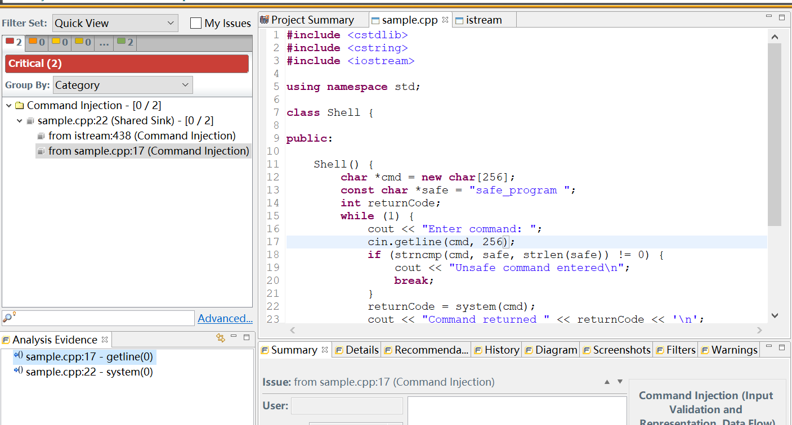

## 0x01 BinaryNinja系列之binja-fuzzit

偶然看到一个项目[binja-fuzzit](https://github.com/ATorNinja/binja-fuzzit)  
对库函数生成对应的harness，来进行fuzz

`gcc -g -O0 -shared -fPIC vulns_shared.c -o vulns_shared.so`  

加载、执行插件  
生成harness.c   
编译`gcc -ldl harness.c -o harness`  
测试

```
python3 tob.py | LD_LIBRARY_PATH=. ./vuln_harn
(null)
loaded vuln at 0x7fffeb68e280
loaded _init_0 at (nil)
loaded init_buffer_0 at (nil)
loaded buffer_overflow_0 at (nil)
loaded keyword_buffer_overflow_0 at (nil)
loaded integer_overflow_0 at (nil)
loaded _fini_0 at (nil)
Segmentation fault (core dumped)
```

可以直接上`LD_LIBRARY_PATH=. AFL_INST_LIBS=1 AFL_NO_FORKSRV=1 ~/afl-2.52b/afl-fuzz -Q -iin -oout -- ./harness`  

原理还没时间看，不过看起来还需要处理一下函数的参数类型，应该还有很大的完善空间吧  

## 0x02 Fortify SCA

对于[样例](./2020.05.08/sample.cpp)  

```bash
sourceanalyzer -b sample-cpp -clean
sourceanalyzer -b sample-cpp cl /EHsc sample.cpp
sourceanalyzer -b sample-cpp -scan 

[0C953FD0FC448C81961F09066517A81A : critical : Command Injection : dataflow ]
sample.cpp(22) :  ->system(0)
    sample.cpp(17) : <- basic_istream::getline(0)

[AF3D375F5B573EA2A33EFFB49AD83537 : critical : Command Injection : dataflow ]
sample.cpp(22) :  ->system(0)
    sample.cpp(17) : <- basic_istream::getline(0)
    D:/software/vs2019/VC/Tools/MSVC/14.25.28610/include/istream(438) : <- basic_istream::getline(0)

[578333F74CD07D23917F61DE1DF24023 : high : Memory Leak : controlflow ]

    sample.cpp(29) : start -> allocated : operator new(...)
    sample.cpp(30) : allocated -> allocated : return
    sample.cpp(30) : allocated -> leak : end scope : Memory leaked

[6DF66EE6E33B073CC46B4F4F5619DA49 : high : Memory Leak : controlflow ]

    sample.cpp(12) : start -> allocated : cmd = operator new[](...)
    sample.cpp(12) : allocated -> allocated : cmd refers to dynamically allocated memory
    sample.cpp(20) : goto
    sample.cpp(25) : allocated -> allocated : cmd no longer refers to dynamically allocated memory
    sample.cpp(25) : allocated -> leak : cmd end scope : Memory leaked
```

-f xxx.fpr指定结果保存文件，使用Audit Workbench打开  



可以看到还有数据流的高亮  

自己写一个[测试程序](./2020.05.08/testfsca.c)，然后可以指定检测规则  

```bash
sourceanalyzer.exe -b mybuild1 -rules "D:\\software\\fsca\\Core\\config\\rules\\extended_cpp.bin" -rules "D:\software\fsca\Core\config\rules\core_cpp.bin"  -scan

[3F44C57E25226E8C8E841B00E24B61B7 : critical : Buffer Overflow : buffer ]
h.c(7) : memcpy()
   Buffer Definition, buf h.c(5)
 Buffer Size: 10 bytes
 Write Length: 59 bytes
```

好的吧。。。。   

```c
//testfsa.c
#include <stdio.h>
#include <string.h>

int main(int argc, char *argv[]){
    char buf[10];
    char *src = "Hello world,Lambda,hhhhhhhhhalallalalalalallallalalallalala";
    memcpy(buf,src, strlen(src));
    for(int i = 1; i < 10000; i++){buf[i] = i;}
    return 0;
}

```

对于cmake、make之类的，加touchless即可  

`sourceanalyzer -b name touchless  cmake ...`  

哎，不过对工作的项目进行测试，是真的麻烦，编译工程总出问题，而且scan的时候并没有扫完全部代码  

