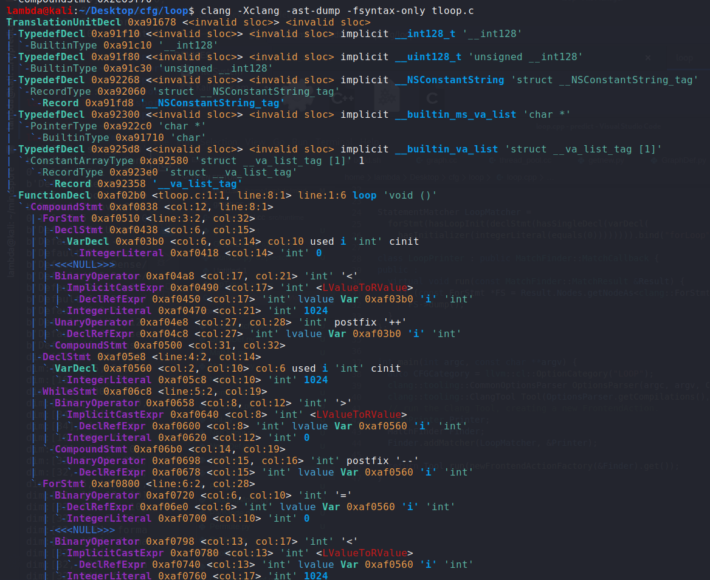

## 0x01 Clang LibTooling AST  

[Generating source-level Control Flow Graph](http://s4.ce.sharif.edu/blog/2019/12/31/clang/)  

之前一直都是初步的使用LLVM，没有用过Clang，了解一下  

测试环境  
kali 2020.2  
clang 9.0.1  
llvm 9.0.1  

需要安装一些库以及头文件`sudo apt install clang-tools-9 libclang-9-dev`  

不懂作者的目的:  
> needed to find all possible paths a program could traverse during its execution, also needed to modify a few of the basic blocks in the given source code  

Clang在ASTContext保存全部的AST节点，相关定义在ASTContext.h中。在ASTConsumer.h中定义了接口ASTConsumer，可以使用AST  
那么可以继承ASTConsumer然后重载HandleTranslationUnit(clang::ASTContext&)  

一般的逻辑就是遍历，然后对每个节点做操作  
除此之外，还可以指定节点的类型，针对不同类型的节点做不同的操作，具体使用了`clang::ast_matchers`，如在[示例程序](./2020.05.12/cfg.cpp)的38行指定了对函数声明的操作，匹配到后
，执行MatchCallback，进行具体的处理  

make，执行`./cfg code.cpp --`  

[ASTMatchers](http://clang.llvm.org/docs/LibASTMatchersReference.html)的文档  

相比LLVM而言，基于Clang开发的话，可能会在更高层，不用在IR中摸爬滚打。。。。   

## 0x02 [IntroductionToTheClangAST](http://clang.llvm.org/docs/IntroductionToTheClangAST.html)  

`clang -Xclang -ast-dump -fsyntax-only tloop.c`  



显示函数loop声明，然后一个compound statement，其中包含ForStmt、DeclStmt、WhileStmt  

AST中最基本的节点就是语句Stmt和声明Decl   

## 0x03 [LibASTMatchersTutorial](http://clang.llvm.org/docs/LibASTMatchersTutorial.html)  

写了一个查找`for (int i= 0; i < expr(); ++i)`语句的代码   

框架就是`MatchFinder Finder;Finder.addMatcher(LoopMatcher, &Printer);`  

LoopMatcher就是规则，感觉和正则表达式似的。。。  
```
StatementMatcher LoopMatcher =
    forStmt(hasLoopInit(declStmt(
                hasSingleDecl(varDecl(hasInitializer(integerLiteral(equals(0))))
                                  .bind("initVarName")))),
            hasIncrement(unaryOperator(
                hasOperatorName("++"),
                hasUnaryOperand(declRefExpr(
                    to(varDecl(hasType(isInteger())).bind("incVarName")))))),
            hasCondition(binaryOperator(
                hasOperatorName("<"),
                hasLHS(ignoringParenImpCasts(declRefExpr(
                    to(varDecl(hasType(isInteger())).bind("condVarName"))))),
                hasRHS(expr(hasType(isInteger())))))).bind("forLoop");
```

根据规则找到后，然后继承MatchFinder::MatchCallback，定义run就好  

整个for语句的规则叫forLoop  
第一个initVarName规则，需要有变量的初始化，而且初始化为0  
第二个incVarName规则，一个整型的自增，这个变量要在第一个规则中进行过初始化，但matcher中没有判断两个节点是否相等的逻辑，所以需要自己在之后的操作中进行比对    
第三个condVarName规则。。。。   

然后使用`getNodeAs<VarDecl>`获取节点，进行比较判断   

哎 大体了解一下就好了。。。看起来又是基本的找API、敲代码   

看了看[libtooling_step_by_step](https://github.com/jfultz/libtooling_step_by_step)  
刚才的都只是获取数据，其实还可以更改AST  
项目实现了：颠倒if判断的左右值，更换函数名称，打印函数声明

可是使用`clang -cc1 -analyzer-checker-help`来看一下clang提供的各种静态检测功能    
针对项目可以使用scan-build

垃圾CSDN上有一个[clang static analyzer源码分析](https://blog.csdn.net/dashuniuniu/category_6013535.html)的文章，有时间再看吧。。。。。。。。。。


