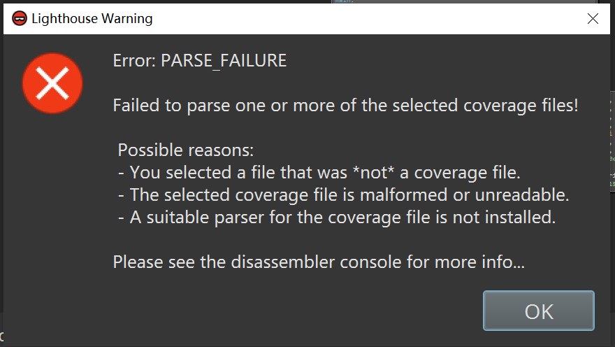
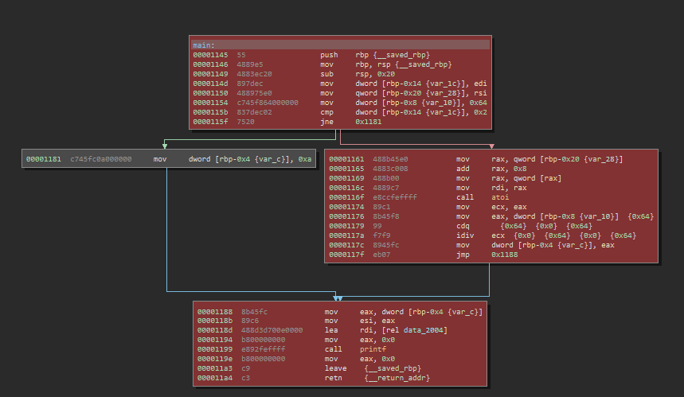

## 0x01 覆盖率  

编译程序添加`--coverage`，等效于`-fprofile-arcs -ftest-coverage -lgcov`  
编译生成完之后会有.gcno文件，也许还有.gcda文件，.gcno文件千万别删。。。。  

本想用[afl-cov](https://github.com/mrash/afl-cov)来统计，但是发现了[gcovr](https://github.com/gcovr/gcovr)  

`gcovr -r . --html --html-details -o coverage.html`看起来明显更方便一些

但是一般覆盖率只是用fuzzing过程中队列的用例，有些比如Abort或者SegFault的用例使程序直接崩溃，不能得到覆盖率文件  

参考[core-dump-and-gcov-coverage-report](https://stackoverflow.com/questions/5696093/core-dump-and-gcov-coverage-report)  

就是在自己的harness中，设置自定义的信号量处理代码，比如当SIGSEGV发生时，直接使用`__gcov_flush`刷新  

```c
//gcc --coverage hello.c -o hello
#include <stdio.h>  
#include <signal.h>
#include <sys/types.h>
#include <unistd.h>
#include <stdlib.h>

extern "C" void __gcov_flush(); //或者void __gcov_flush(void); 

void my_handler(int signum){
    __gcov_flush(); //当SIGSEGV时dump
}

int main(int argc, char **argv){
    struct sigaction new_action, old_action;
    int n;

    new_action.sa_handler = my_handler;
    sigemptyset(&new_action.sa_mask);
    new_action.sa_flags = 0;

    sigaction(SIGSEGV, NULL, &old_action);
    if (old_action.sa_handler != SIG_IGN)
        sigaction(SIGSEGV, &new_action, NULL);

}
```

但是又有一个问题，测试时发现虽然可以生成覆盖率文件，但是程序并不能退出，所以只是在运行时加一个timeout还解决的  

## 0x02 BN的代码覆盖率插件

比较有名气的当然是[lighthouse](https://github.com/gaasedelen/lighthouse)  
之前在IDA中用过，不过，直接放在BN的插件目录下是不行的吧？？？反正我的不行  

BN的插件[demo](https://github.com/Vector35/sample_plugin)，需要有`plugin.json`还有`__init__.py`，一般小的插件直接在一个py文件中就写完了  
所以写一个`from .lighthouse.integration.binja_loader import *`就好，lighthouse为了通用性，对于BN直接改的UI，比一般使用BN接口定义插件的方式麻烦太多了  

提供了基于frida还有pin的获取覆盖率信息的程序，不过frida的为什么只能attach到指定的进程？？？  
所以选择了pin，版本3.11，用了release的DLL版本，结果生成的log文件不能插件正常解析？？？   
编译个so的吧，还是不行？？？   



再见，我用[bncov](https://github.com/ForAllSecure/bncov)  
没想到可以直接使用之前生成的log文件，哈？？？？   
> Currently the plugin only deals with block coverage and ingests files in the drcov2 format  

提供了dr_block_coverage.py，不过需要DynamoRIO    



