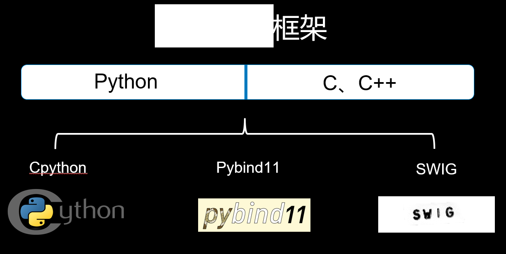
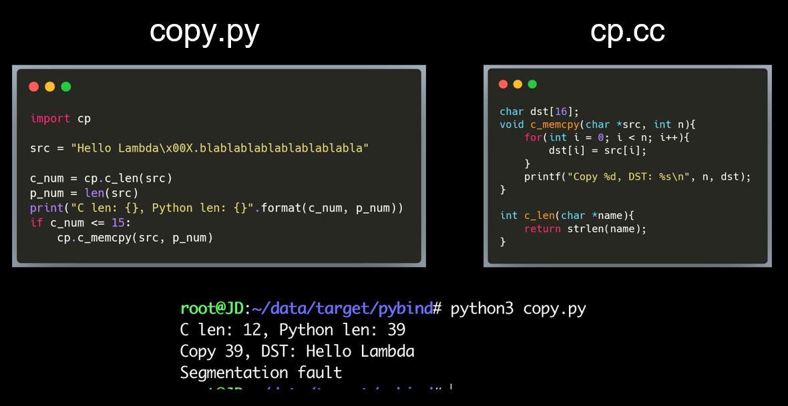

## 0x01 LKM Linux rootkit 

[Reptile](https://github.com/f0rb1dd3n/Reptile)  

主要是想看一下进程隐藏是怎么实现的  

根据传入的pid，遍历for_each_process，然后get_task_struct，惊叹竟然还有这么直接的函数  
首先判断task是否可见  
```c
#define PF_FREEZER_NOSIG 0x80000000 /* Freezer won't send signals to it */  
#define FLAG 0x80000000
task->flags & FLAG;
```

get_task_struct会增加task的usage，所以之后调用put_task_struct来将task的usage减一  

判断完之后，进行设置`task->flags |= FLAG;`  

就这？？？印象中还有什么从链表中摘除的操作之类的    

ps命令使用getdents读取/proc目录下的进程文件，对应的系统调用是`int sys_getdents(unsigned int fd, struct linux_dirent64 __user *dirp, unsigned int count)`

所以有一种方法就是hook这个系统调用   

有时间再看，不过感觉是没时间了  

[聊一聊Linux下进程隐藏的常见手法及侦测手段](https://www.anquanke.com/post/id/160843)  
[CRUX下实现进程隐藏](https://www.cnblogs.com/wacc/p/3674102.html)  
[进程隐藏与进程保护(SSDT Hook 实现)](https://www.cnblogs.com/zmlctt/p/3979105.html)    

## 0x02 其他 

头疼，有一个越界写，可以写一些堆数据。。。但是怎么获取shell

做了两页没用的PPT  

  
 

头疼头疼