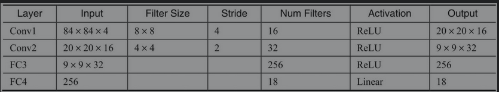

## 0x01 DQN

《强化学习与Pytorch》

深度强化学习会受到两个领域各自缺点的影响，比如Q-Learning有过估计问题、收敛效率低   

#### 2013 Playing Atari with Deep Reinforcement Learning  
第一次尝试把Q-Learning和DNN结合

  
看起来结构好简单啊  
接收一个连续4帧84×84的图像  

初始化一个Replay Memory，其最大容量为N。Replay Memory是为了存储Transition信息而设置的，就是每个Step在玩游戏时收集的(s,a,r,s′)  

贝尔曼方程   
伴随每个Step，从里面拿出一些Transition来做估值更新   

#### 2015  

主网络和目标网络的分离，Target网络的好处是：可以在一段时间内使拟合的标签相对稳定，从而让主网络的收敛平稳一些。Target网络的好处是：可以在一段时间内使拟合的标签相对稳定，从而让主网络的收敛平稳一些。  

#### Double DQN  

Double DQN（或者说Double Q-Learning）带来的好处，就是在学习估值的时候用max来做评估，在选择输出动作的时候用另一个没有做max评估的权重集合来做动作，从而在一定程度上降低了发生过估计的可能性

####  Dueling DQN  

提供两个分离的估值函数，一个是状态估值函数，另一个是独立于状态的动作优势估值函数   
> 怎么理解比较简单呢？例如，在评估下棋的策略时——有的盘面本身价值很高，也就是说，眼看就要赢了，走哪一步都差不多；有的盘面价值一般，状态胶着，局势不明朗，但是一些步子走出来价值就很高，步子和步子之间的估值差异比较大。这种解耦的假设，也会帮助网络学到更为准确的状态价值的估值，从而更有效地找到好的策略。

为什么觉得就是基于覆盖率信息的Fuzz。。。